# Real Estate CRM System Flow Diagrams

## 🔄 Complete System Architecture

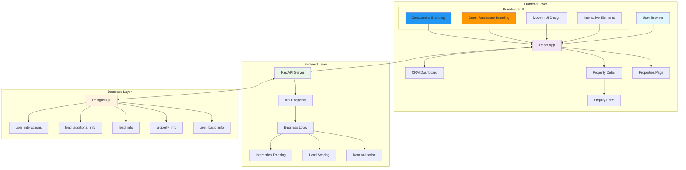

## 📊 Data Flow Diagrams

### 1. User Registration & Enquiry Flow

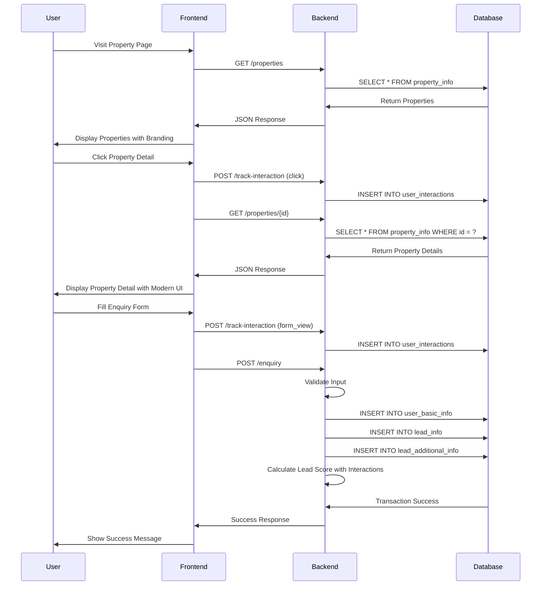

### 2. CRM Dashboard Flow

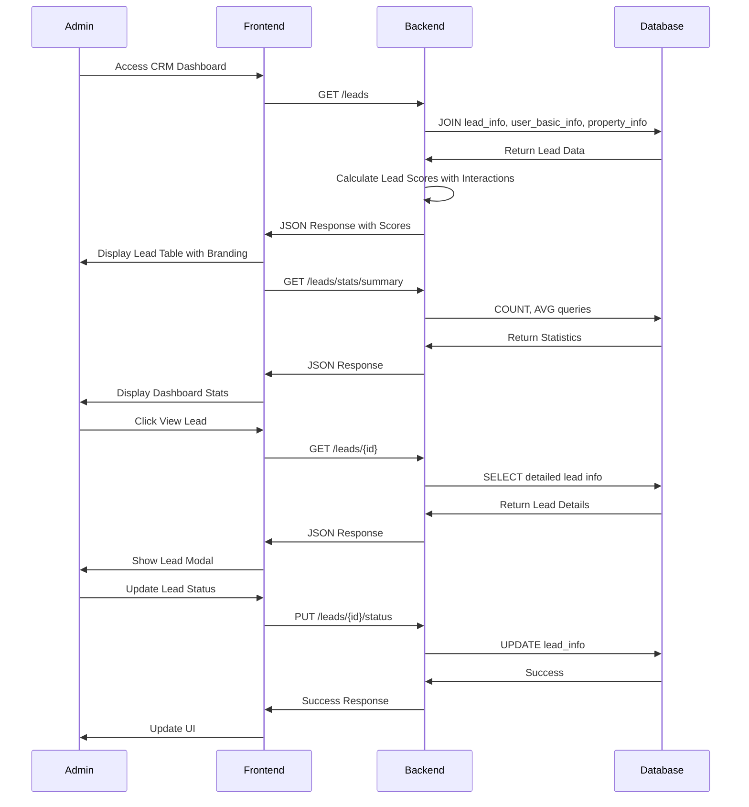

## 🎯 Enhanced Lead Scoring Flow

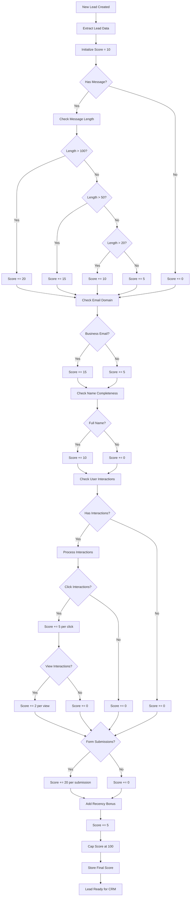

## 🔄 State Management Flow

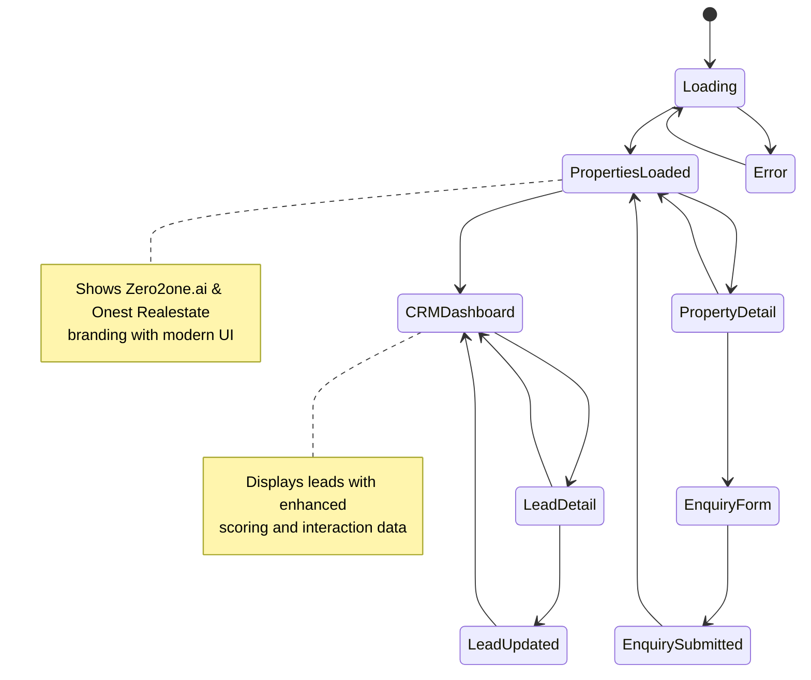

## 🗄️ Enhanced Database Relationship Flow

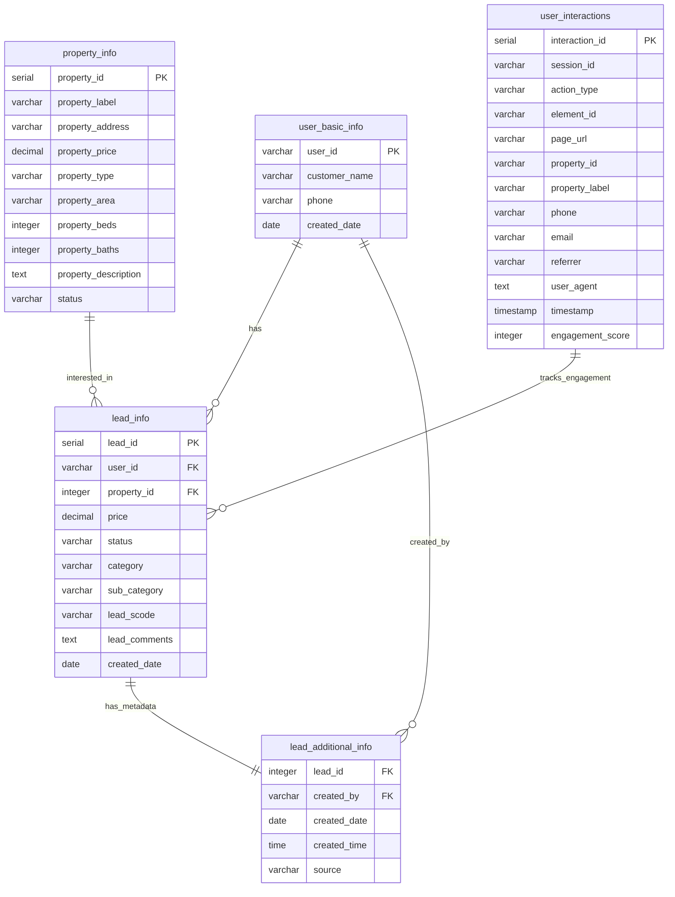

## 🚀 Application Startup Flow

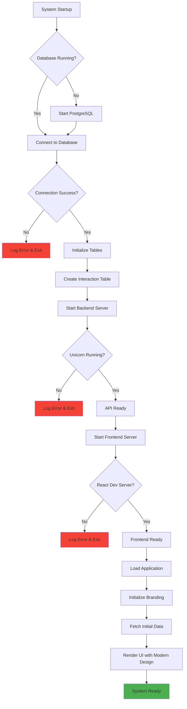

## 🔍 Enhanced Error Handling Flow

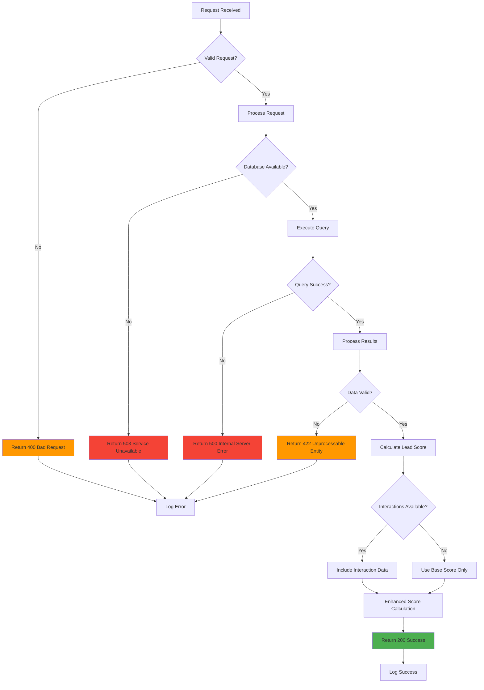

## 📱 Enhanced User Journey Flow

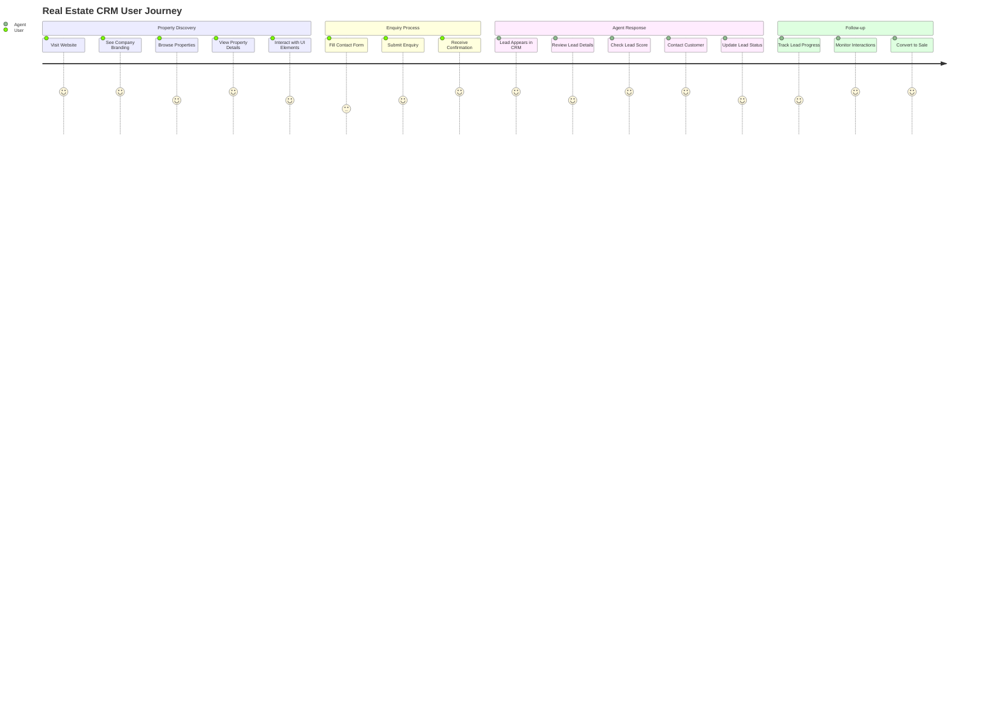

## 🔧 Development Workflow

```mermaid
gitgraph
    commit
    branch feature/new-property
    checkout feature/new-property
    commit
    commit
    checkout main
    merge feature/new-property
    branch hotfix/database-connection
    checkout hotfix/database-connection
    commit
    checkout main
    merge hotfix/database-connection
    branch feature/interaction-tracking
    checkout feature/interaction-tracking
    commit
    commit
    checkout main
    merge feature/interaction-tracking
    commit
```

## 📊 Performance Monitoring Flow

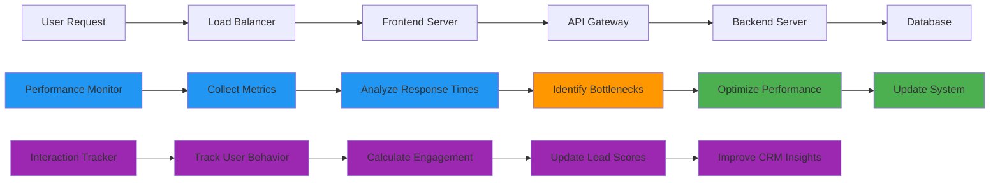

## 🎨 UI/UX Design Flow

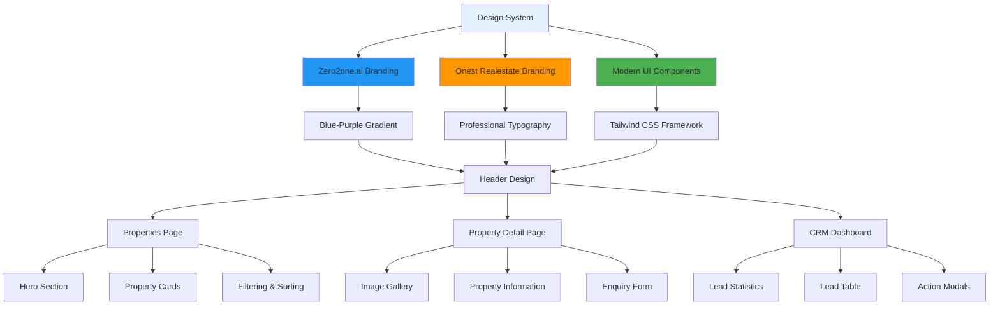

## 🔄 Interaction Tracking Flow

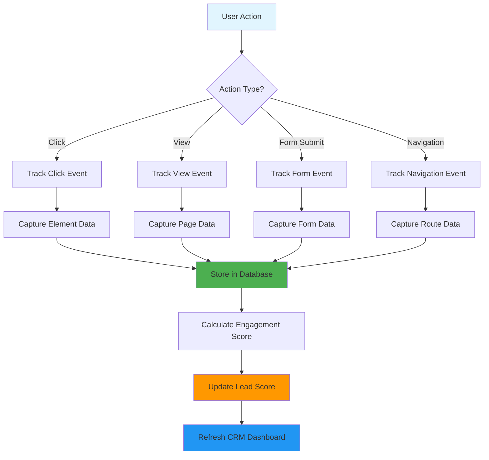

---

## 📝 Enhanced Flow Summary

### Entry Points:
1. **User Entry**: Browser → React App → Properties Page (with branding)
2. **Admin Entry**: Browser → React App → CRM Dashboard (with enhanced scoring)
3. **API Entry**: External systems → FastAPI endpoints → Interaction tracking

### Exit Points:
1. **User Exit**: Success message after enquiry submission with modern UI
2. **Admin Exit**: Lead status updates and CRM actions with enhanced insights
3. **System Exit**: Error responses and validation failures with proper logging

### Data Movement:
1. **User Input** → **Frontend Validation** → **API Request** → **Backend Processing** → **Database Storage** → **Interaction Tracking**
2. **Database Query** → **Backend Processing** → **Lead Score Calculation** → **API Response** → **Frontend Rendering** → **User Display**
3. **Lead Creation** → **Enhanced Score Calculation** → **CRM Dashboard** → **Agent Actions** → **Status Updates** → **Performance Monitoring**

### Key Decision Points:
1. **Input Validation**: Accept/Reject user input with enhanced validation
2. **Lead Scoring**: Determine lead priority with interaction data
3. **Status Management**: Track lead progression with modern UI
4. **Error Handling**: Graceful failure management with proper logging
5. **Performance Optimization**: System efficiency monitoring with interaction tracking
6. **Branding Integration**: Consistent Zero2one.ai and Onest Realestate branding
7. **UI/UX Enhancement**: Modern design with interactive elements

### New Features Added:
1. **Interaction Tracking**: Monitor user behavior for better lead scoring
2. **Enhanced Branding**: Professional company branding throughout the application
3. **Modern UI Design**: Improved visual design with Tailwind CSS
4. **Enhanced Navigation**: Seamless navigation between Properties and CRM
5. **Improved Lead Scoring**: More accurate scoring with interaction data
6. **Better Error Handling**: Comprehensive error management and logging

This comprehensive flow documentation provides a complete understanding of how data moves through the enhanced Real Estate CRM system, from user interaction to database storage and back, with modern UI/UX design and professional branding. 